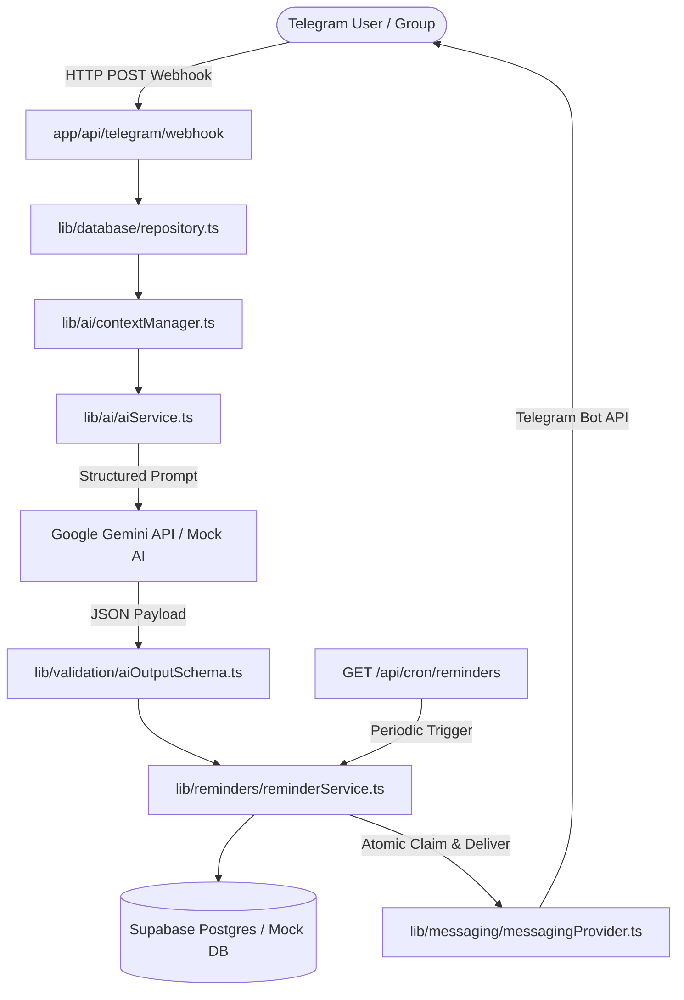
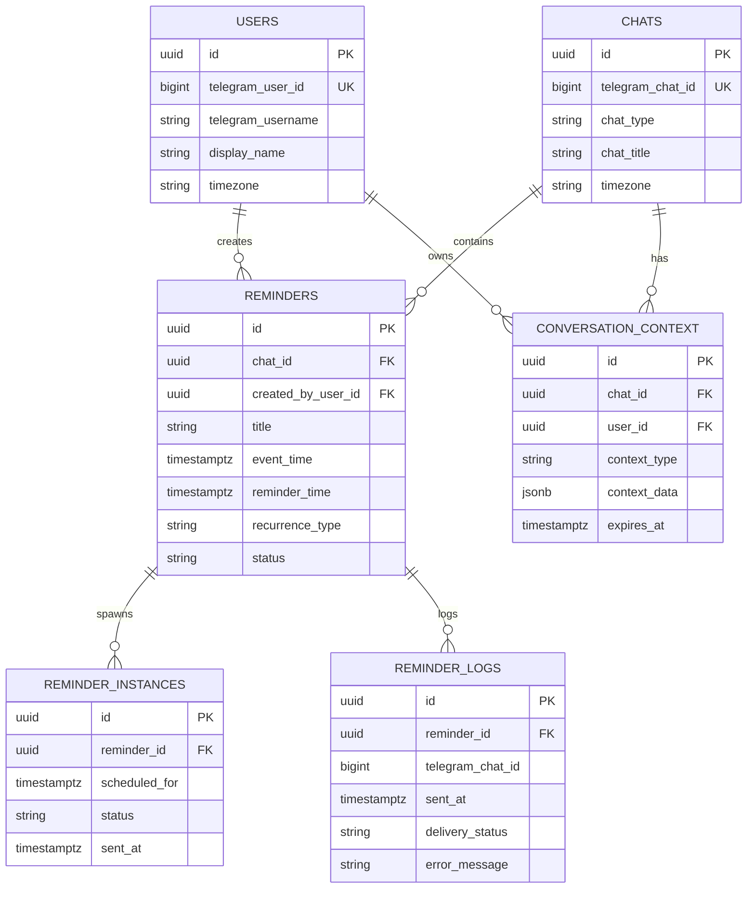

# ARCHITECTURE.md — Remindly Technical System Architecture

## 1. System Overview

Remindly is designed as a modular, event-driven AI agent architecture that processes natural-language text from messaging platforms (Telegram), extracts intent & time commitments into validated structured JSON, persists state in PostgreSQL (Supabase), and triggers timely notifications via an idempotent cron scheduler engine.



---

## 2. AI Execution Pipeline & Clarification State Machine

The AI pipeline is strictly decoupled from database mutation operations. Free-form model output is never executed directly.

1. **Ingestion**: Message received at `/api/telegram/webhook`.
2. **Context Lookup**: Checks `conversation_context` table for active pending clarifications (e.g. `AWAITING_TIME`).
3. **Structured Prompt Construction**: Includes current server timestamp in target timezone (`Asia/Kolkata`) and JSON schema instructions.
4. **Parsing**: Gemini API returns candidate JSON.
5. **Schema Validation**: Zod (`aiOutputSchema.ts`) validates intent, dates, times, and recurrence rules.
6. **Clarification Intercept**: If required details (such as exact meeting time) are missing, intent is resolved to `CLARIFY`. A 15-minute clarification session is recorded in `conversation_context`, and a follow-up question is sent back to the user.

---

## 3. Database Entity Model



---

## 4. Idempotent Scheduler Engine

To prevent duplicate notification delivery across concurrent cron executions:
1. `GET /api/cron/reminders` queries `reminder_instances` where `status = 'scheduled'` and `scheduled_for <= NOW()`.
2. For each instance, it executes an atomic claim query (`UPDATE reminder_instances SET status = 'claimed' WHERE id = :id AND status = 'scheduled'`).
3. If zero rows are updated, another runner has claimed the task.
4. If claimed successfully, the notification is sent via `MessagingProvider`.
5. Upon delivery success, status transitions to `'sent'`, and an entry is logged in `reminder_logs`.

---

## 5. Extensible Messaging Provider Pattern (WhatsApp / Slack / Discord Support)

The messaging layer is decoupled behind the `MessagingProvider` interface:

```typescript
export interface MessagingProvider {
  name: string;
  sendMessage(chatId: number | string, text: string): Promise<boolean>;
  sendNotification(
    chatId: number | string,
    title: string,
    timeText: string,
    isGroup: boolean,
    extraInfo?: string
  ): Promise<boolean>;
}
```

- **TelegramProvider**: Implemented for MVP.
- **Future Providers**: `WhatsAppProvider` (using WhatsApp Business API / Twilio), `SlackProvider`, `DiscordProvider` can be registered in `messagingRegistry` without touching reminder engine logic.

---

## 6. Group Permissions Model

- In **Private Chats**, the user owns all reminder lifecycle actions.
- In **Group Chats**, any member can create reminders targeted to the group.
- Destructive operations (`CANCEL_REMINDER`, `UPDATE_REMINDER`) on group reminders require either:
  1. Creator ownership (`created_by_user_id === user.id`), OR
  2. Group administrator privilege (`getChatMemberRole` returns `'administrator'` or `'creator'`).
