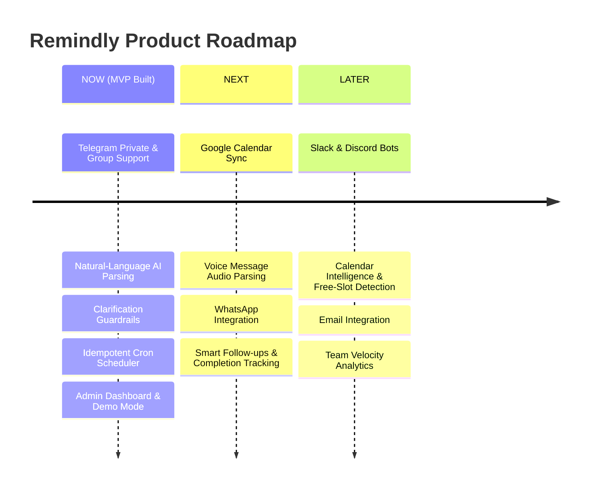

# PRODUCT.md — Remindly Product Vision & Strategy

## 1. Product Vision

**REMINDLY**: *"An AI agent that turns conversations into commitments and reminders."*

### Core Job-To-Be-Done
When people speak in everyday conversations (e.g. *"I'll submit the assignment tomorrow at 6"*, *"Presentation Friday at 10 AM, remind us Thursday evening"*), commitments are easily lost or forgotten. Traditional reminder apps force users to manually navigate date pickers, set notifications, and learn bot slash commands (`/remind @user ...`).

Remindly eliminates friction by letting users converse naturally on messaging platforms they already use (Telegram). Remindly captures commitments, asks clarifying questions when details are ambiguous, and sends timely reminders to individuals or group channels.

---

## 2. Target Persona & Key Use Cases

- **College Students & Study Groups**: Assignment deadlines, lab submission dates, exam countdowns.
- **Student Project Teams & Hackathon Squads**: Team sync meetings, slide presentation deliverables, peer review deadlines.
- **Young Professionals & Small Remote Teams**: Recurring weekly status reports, client follow-ups, payment due dates.
- **Clubs & Communities**: Event announcements, meetup reminders.

---

## 3. Product Principles

1. **Zero Command Learning**: Users talk naturally. No `/add_reminder --date 2026-10-10`.
2. **Never Guess Ambiguous Scheduling**: If date or time details are missing, ask for clarification.
3. **Group First**: Telegram group chats are first-class targets, not just 1-on-1 private DMs.
4. **Reliability & Idempotency**: A reminder must never be missed, nor delivered twice.

---

## 4. MVP Scope vs Future Roadmap

### Features Implemented NOW (MVP Complete):
- [x] Telegram Private & Group Chat Support
- [x] Natural Language Parsing (Absolute, Relative, Duration, Recurring)
- [x] AI Clarification System for missing/ambiguous info
- [x] Action Intent Dispatcher (Create, Update, Cancel, List)
- [x] Group Permissions Safety Model
- [x] Idempotent Cron Scheduler
- [x] Admin Dashboard (Metrics, Reminders, Connected Chats, Delivery Audit Logs)
- [x] Interactive Demo & Mock Mode (No credentials required for testing)
- [x] Automated Test Suite
